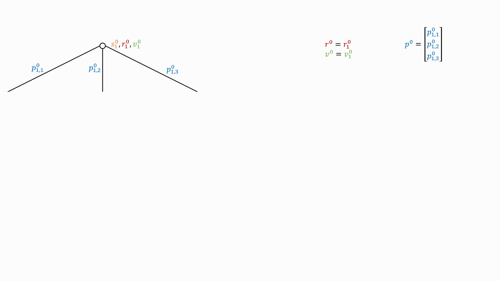
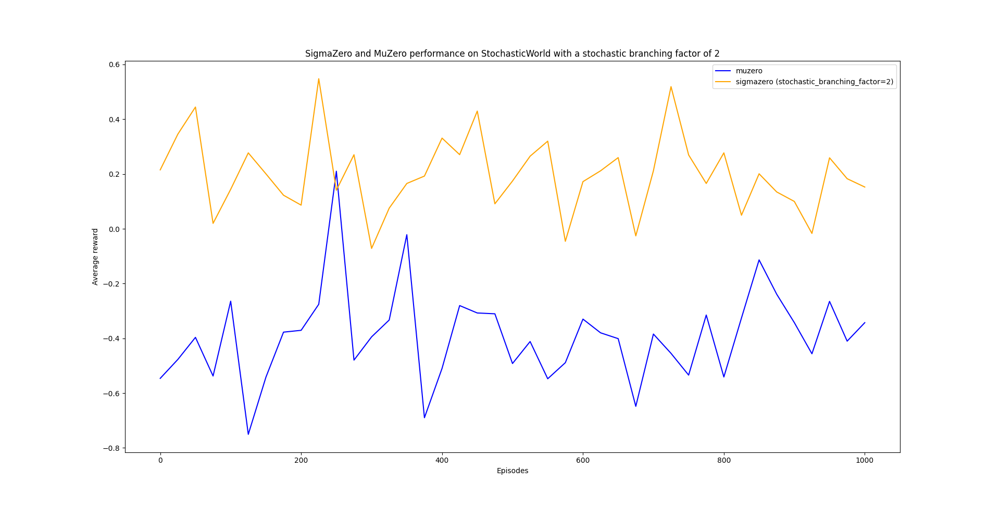
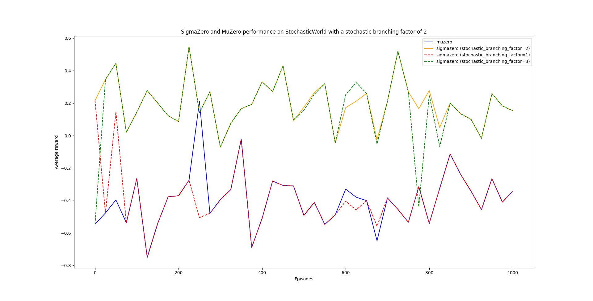

# SigmaZero
This is a repo where I generalize DeepMind's MuZero reinforcement learning algorithm on stochastic environments, and create an algorithm called SigmaZero (stochastic MuZero). For more details on the MuZero algorithm, check out the original [paper](https://www.nature.com/articles/s41586-020-03051-4.epdf?sharing_token=kTk-xTZpQOF8Ym8nTQK6EdRgN0jAjWel9jnR3ZoTv0PMSWGj38iNIyNOw_ooNp2BvzZ4nIcedo7GEXD7UmLqb0M_V_fop31mMY9VBBLNmGbm0K9jETKkZnJ9SgJ8Rwhp3ySvLuTcUr888puIYbngQ0fiMf45ZGDAQ7fUI66-u7Y%3D) and my [project](https://github.com/chiamp/muzero-cartpole) on applying the MuZero algorithm on the cartpole environment.

## Table of Contents
* [MuZero](#muzero)
* [Monte Carlo Tree Search in Stochastic Environments](#monte-carlo-tree-search-in-stochastic-environments)
* [SigmaZero](#sigmazero-1)
* [Environment](#environment)
* [Experiments](#experiments)
* [Discussions](#discussions)
* [Future Work](#future-work)
* [File Descriptions](#file-descriptions)

## MuZero

### Functions
MuZero contains 3 functions approximated by neural networks, to be learned from the environment:
* A representation function, $h(o_t) \rightarrow s^0$, which given an observation $o_t$ from the environment at time step $t$, outputs the hidden state representation $s^0$ of the observation at hypothetical time step $0$ (this hidden state will be used as the root node in MCTS, so its hypothetical time step is zero)
	* The representation function is used in tandem with the dynamics function to represent the environment's state in whatever way the algorithm finds useful in order to make accurate predictions for the reward, value and policy
* A dynamics function, $g(s^k,a^{k+1}) \rightarrow s^{k+1},r^{k+1}$, which given a hidden state representation $s^k$ at hypothetical time step $k$ and action $a^{k+1}$ at hypothetical time step $k+1$, outputs the predicted resulting hidden state representation $s^{k+1}$ and transition reward $r^{k+1}$ at hypothetical time step $k+1$
	* The dynamics function is the learned transition model, which allows MuZero to utilize MCTS and plan hypothetical future actions on future board states
* A prediction function, $f(s^k) \rightarrow p^k,v^k$, which given a hidden state representation $s^k$, outputs the predicted policy distribution over actions $p^k$ and value $v^k$ at hypothetical time step $k$
	* The prediction function is used to limit the search breadth by using the policy output to prioritize MCTS to search for more promising actions, and limit the search depth by using the value output as a substitute for a Monte Carlo rollout

### Algorithm Overview
The MuZero algorithm can be summarized as follows:
* loop for a number of episodes:
	* at every time step $t$ of the episode:
		* perform Monte Carlo tree search (MCTS)
			* pass the current observation of the environment $o_t$ to the representation function, $h(o_t) \rightarrow s^0$, and get the hidden state representation $s^0$ from the output
			* pass the hidden state representation $s^0$ into the prediction function, $f(s^0) \rightarrow p^0,v^0$, and get the predicted policy distribution over actions $p^0$ and value $v^0$ from the output
			* for a number of simulations:
				* select a leaf node based on maximizing UCB score
				* expand the node by passing the hidden state representation of its parent node $s^k$ and its corresponding action $a^{k+1}$ into the dynamics function, $g(s^k,a^{k+1}) \rightarrow s^{k+1},r^{k+1}$, and get the predicted resulting hidden state representation $s^{k+1}$ and transition reward $r^{k+1}$ from the output
				* pass the resulting hidden state representation $s^{k+1}$ into the prediction function, $f(s^{k+1}) \rightarrow p^{k+1},v^{k+1}$, and get the predicted policy distribution over actions $p^{k+1}$ and value $v^{k+1}$ from the output
				* backpropagate the predicted value $v^{k+1}$ up the search path
		* sample an action based on the visit count of each child node of the root node
		* apply the sampled action to the environment and observe the resulting transition reward
	* once the episode is over, save the game trajectory (including the MCTS results) into the replay buffer
	* sample a number of game trajectories from the replay buffer:
		* pass the first observation of the environment $o_0$ from the game trajectory to the representation function, $h(o_0) \rightarrow s^0$ and get the hidden state representation $s^0$ from the output
		* pass the hidden state representation $s^0$ into the prediction function, $f(s^0) \rightarrow p^0,v^0$, and get the predicted policy distribution over actions $p^0$ and value $v^0$ from the output
		* for every time step $t$ in the game trajectory:
			* pass the current hidden state representation $s^t$ and the corresponding action $a^{t+1}$ into the dynamics function, $g(s^t,a^{t+1}) \rightarrow s^{t+1},r^{t+1}$, and get the predicted resulting hidden state representation $s^{t+1}$ and transition reward $r^{t+1}$ from the output
				* this predicted transition reward $r^{t+1}$ is matched to the actual transition reward target received from the environment
			* pass the resulting hidden state representation $s^{t+1}$ into the prediction function, $f(s^{t+1}) \rightarrow p^{t+1},v^{t+1}$, and get the predicted policy distribution over actions $p^{t+1}$ and value $v^{t+1}$ from the output
				* this predicted policy distribution $p^{t+1}$ is matched to the child node visit count distribution outputted by MCTS at that time step in that game trajectory
				* this predicted value $v^{t+1}$ is matched to the value outputted by MCTS at that time step in that game trajectory
			* update the weights of the representation, dynamics and prediction function based on these three targets

## Monte Carlo Tree Search in Stochastic Environments

MCTS requires a model of the environment when expanding leaf nodes during its search. The environment model takes in a state and action and outputs the resulting state and transition reward; this is the functional definition of the dynamics function, $g(s^k,a^{k+1}) \rightarrow s^{k+1},r^{k+1}$, which approximates the true environment model. This works for deterministic environments where there is a single outcome for any action applied to any state.

In stochastic environments, the functional definition of the environment model changes. Given a state and action, the environment model instead outputs a **set** of possible resulting states, transition rewards and the corresponding probabilities of those outcomes occurring. To approximate this environment model, we can re-define the dynamics function as: $g(s^k,a^{k+1}) \rightarrow [s^{k+1}_1,...,s^{k+1}_b],[r^{k+1}_1,...,r^{k+1}_b],[\pi^{k+1}_1,...,\pi^{k+1}_b]$, where $\pi^{k+1}_i$ is the predicted probability that applying action $a^{k+1}$ to state $s^k$ results in the predicted state $s^{k+1}_i$ with transition reward $r^{k+1}_i$.

Given a current state $s$ and action $a$, a perfect environment model would output a corresponding probability for every possible transition sequence $s,a \rightarrow s^{'},r$, where $s^{'}$ is the resulting state and $r$ is the resulting transition reward. To approximate this with the dynamics function, we would need to define the function to output a number of predicted transitions $(s^{k+1}_i,r^{k+1}_i,\pi^{k+1}_i)$ equal to all possible transitions of the environment. This requires additional knowledge of the environment's state space, reward space and transition dynamics.

Instead we define a **stochastic branching factor** hyperparameter  $b$ which sets and limits the number of predicted transitions the dynamics function can output. MCTS can then use this modified dynamics function to expand nodes and account for stochastic outcomes.

Below is an animation illustrating how MCTS is executed in stochastic environments (you can find the individual pictures in `assets/sigmazero_graph_images/` for closer inspection). In this environment, the action space is size 3 and the stochastic branching factor hyperparameter is set to 2.

Instead of a single node representing a state, we have a **node set** representing a number of possible stochastic states, that are a result of applying a sequence of actions starting from the state at the root node. For example, $[s^2_1,s^2_2,s^2_3,s^2_4]$ are the predicted possible states as a result of applying the action $a_3$ to the state at the root node $s^0_1$, followed by applying action $a_1$ to the resulting stochastic states $[s^1_1,s^1_2]$. And thus, $[r^2_1,r^2_2,r^2_3,r^2_4]$ are the predicted transition rewards, $[v^2_1,v^2_2,v^2_3,v^2_4]$ are the predicted values and $[p^2_1,p^2_2,p^2_3,p^2_4]$ are the predicted policy distributions over actions for each corresponding stochastic state.

Just like nodes used for MCTS in deterministic environments, node sets also contain a predicted reward, value and policy distribution attribute. Whereas in the former case where the predicted reward would be obtained directly from the dynamics function output and the predicted value and policy distribution would be obtained directly from the prediction function output, the predicted reward, value and policy distribution for node sets are calculated **via expectation**.

More formally, to obtain the predicted reward $r_N$, value $v_N$ and policy distribution $p_N$ for a node set $N$, we calculate the following:

$r_N = \sum_{i \in N} \pi_i r_i$

$v_N = \sum_{i \in N} \pi_i v_i$

$p_N = [ \sum_{i \in N} \pi_i p_{i1} , ... , \sum_{i \in N} \pi_i p_{ia} ]$

where $\pi_i$ is the probability of transitioning to the hidden state of node $i$ in node set $N$ after applying the corresponding actions to the state of the root node, $r_i$ is the corresponding transition reward of node $i$ (obtained from the dynamics function output), $v_i$ is the corresponding value of node $i$ (obtained from the prediction function output), and $p_{ia}$ is the corresponding prior probability of taking action $a$ at node $i$ (also obtained from the prediction function output).

Once these three values are computed, MCTS can perform all 4 stages of selection, expansion, simulation and backpropagation on a node set just like it does on a regular node.

## SigmaZero

### Algorithm Overview
The SigmaZero algorithm can be summarized as follows:
* loop for a number of episodes:
	* at every time step $t$ of the episode:
		* perform Monte Carlo tree search (MCTS)
			* pass the current observation of the environment $o_t$ to the representation function, $h(o_t) \rightarrow s^0$, and get the hidden state representation $s^0$ from the output
			* pass the hidden state representation $s^0$ into the prediction function, $f(s^0) \rightarrow p^0,v^0$, and get the predicted policy distribution over actions $p^0$ and value $v^0$ from the output
			* for a number of simulations:
				* select a leaf node set based on maximizing UCB score
				* expand the node set by passing the hidden state representation $s^k_i$ for each node $i$ in the parent node set $N^k$ and the corresponding action $a^{k+1}$ into the dynamics function, $g(s^k_i,a^{k+1}) \rightarrow [s^{k+1}\_{i1},...,s^{k+1}\_{ib}],[r^{k+1}\_{i1},...,r^{k+1}\_{ib}],[\pi^{k+1}\_{i1},...,\pi^{k+1}\_{ib}]$, and get the predicted resulting hidden state representations $[s^{k+1}\_{i1},...,s^{k+1}\_{ib}]$, transition rewards $[r^{k+1}\_{i1},...,r^{k+1}\_{ib}]$ and transition probabilities $[\pi^{k+1}\_{i1},...,\pi^{k+1}\_{ib}]$ from the output, for each parent node $i$
				* create a child node set $N^{k+1}$ and assign its hidden state as the set of all resulting hidden states from applying action $a^{k+1}$ to all parent nodes
				* for each node $j$ in the child node set $N^{k+1}$, update their transition probability so that it represents the probability of transitioning to the state represented by this node after applying the corresponding actions to the state of the root node: $\pi^{k+1}_j \leftarrow \pi^{k+1}_j \pi^k\_{\rho(j)}$, where $\rho(j)$ is the parent node of node $j$
				* assign the transition reward of the child node set $N^{k+1}$ as: $r_{N^{k+1}} = \sum_{j \in N^{k+1}} \pi_j^{k+1} r_j^{k+1}$
				* for each node $j$ in the child node set $N^{k+1}$, pass their resulting hidden state representation $s^{k+1}_j$ into the prediction function, $f(s^{k+1}_j) \rightarrow p^{k+1}_j,v^{k+1}_j$, and get the predicted policy distribution over actions $p^{k+1}_j$ and value $v^{k+1}_j$ from the output
				* assign the policy distribution over actions of the child node set $N^{k+1}$ as: $p_{N^{k+1}} = [ \sum_{j \in N^{k+1}} \pi_j^{k+1} p_{j1}^{k+1} , ... , \sum_{j \in N^{k+1}} \pi_j^{k+1} p_{ja}^{k+1} ]$
				* assign the value of the child node set $N^{k+1}$ as: $v_{N^{k+1}} = \sum_{j \in N^{k+1}} \pi_j^{k+1} v_j^{k+1}$
				* backpropagate the predicted value $v_{N^{k+1}}$ up the search path
		* sample an action based on the visit count of each child node set of the root node set
		* apply the sampled action to the environment and observe the resulting transition reward
	* once the episode is over, save the game trajectory (including the MCTS results) into the replay buffer
	* sample a number of game trajectories from the replay buffer:
		* pass the first observation of the environment $o_0$ from the game trajectory to the representation function, $h(o_0) \rightarrow s^0$ and get the hidden state representation $s^0$ from the output
		* pass the hidden state representation $s^0$ into the prediction function, $f(s^0) \rightarrow p^0,v^0$, and get the predicted policy distribution over actions $p^0$ and value $v^0$ from the output
		* for every time step $t$ in the game trajectory:
			* pass the hidden state representation $s^t_i$ for each node $i$ in the current node set $N^t$ and the corresponding action $a^{t+1}$ into the dynamics function, $g(s^t_i,a^{t+1}) \rightarrow [s^{t+1}\_{i1},...,s^{t+1}\_{ib}],[r^{t+1}\_{i1},...,r^{tk+1}\_{ib}],[\pi^{t+1}\_{i1},...,\pi^{t+1}\_{ib}]$, and get the predicted resulting hidden state representations $[s^{t+1}\_{i1},...,s^{t+1}\_{ib}]$, transition rewards $[r^{t+1}\_{i1},...,r^{t+1}\_{ib}]$ and transition probabilities $[\pi^{t+1}\_{i1},...,\pi^{t+1}\_{ib}]$ from the output, for each node $i$
			* create a node set $N^{t+1}$ and assign its hidden state as the set of all resulting hidden states from applying action $a^{t+1}$ to all nodes of the node set $N^t$ from the previous time step
			* for each node $j$ in the node set $N^{t+1}$, update their transition probability so that it represents the probability of transitioning to the state represented by this node after applying the actions taken in this game trajectory so far to the initial state of this game trajectory: $\pi^{t+1}_j \leftarrow \pi^{t+1}_j \pi^t\_{\rho(j)}$, where $\rho(j)$ is the corresponding node from the previous time step of node $j$
			* assign the transition reward of the node set $N^{t+1}$ as: $r_{N^{t+1}} = \sum_{j \in N^{t+1}} \pi_j^{t+1} r_j^{t+1}$
				* this predicted transition reward $r_{N^{t+1}}$ is matched to the actual transition reward target received from the environment
			* for each node $j$ in the node set $N^{t+1}$, pass their resulting hidden state representation $s^{t+1}_j$ into the prediction function, $f(s^{t+1}_j) \rightarrow p^{t+1}_j,v^{t+1}_j$, and get the predicted policy distribution over actions $p^{t+1}_j$ and value $v^{t+1}_j$ from the output
			* assign the policy distribution over actions of the node set $N^{t+1}$ as: $p_{N^{t+1}} = [ \sum_{j \in N^{t+1}} \pi_j^{t+1} p_{j1}^{t+1} , ... , \sum_{j \in N^{t+1}} \pi_j^{t+1} p_{ja}^{t+1} ]$
				* this predicted policy distribution $p_{N^{t+1}}$ is matched to the child node visit count distribution outputted by MCTS at that time step in that game trajectory
			* assign the value of the node set $N^{t+1}$ as: $v_{N^{t+1}} = \sum_{j \in N^{t+1}} \pi_j^{t+1} v_j^{t+1}$
				* this predicted value $v_{N^{t+1}}$ is matched to the value outputted by MCTS at that time step in that game trajectory
			* update the weights of the representation, dynamics and prediction function based on these three targets

### Implementation details

Rather than a list of nodes, the node set is implemented as a single class object; the same as a node in regular MCTS. Comparisons between how the attributes are implemented between a node and node set are detailed in the table below:

| Attribute | Node  | Node Set |
| ------------- | ------------- | ------------- |
| Prior  | A scalar value obtained from the policy value of the parent node; used to calculate the UCB score | A scalar value obtained from the policy value of the parent node set; used to calculate the UCB score |
| Hidden State Representation  | A $d$-length vector representation of the state represented by this node (where $d$ is determined by a hyperparameter) | An $n \times d$ matrix of vector representations for each stochastic state represented by this node set (where $n$ is the number of nodes in this node set) |
| Transition Probabilities | The Node class does not have this property, but if it were implemented, this value would be 1 | An $n$-length vector that denotes the probability of reaching each node state in the node set, if we were to apply the corresponding actions to the initial state |
| Transition Reward | A scalar value obtained from the dynamics function, denoting the predicted reward received for transitioning to the state represented by this node, from the  state represented by the parent node | A scalar value obtained by taking the expected value of the transition rewards from each node in the node set, denoting the predicted reward received for transitioning to the stochastic state represented by this node set, from the stochastic state represented by the parent node set; we don't need to keep track of the individual transition rewards as only the expected transition reward will be used to match against the target during training |
| Policy | An $a$-length vector obtained from the prediction function, denoting the prior action distribution for the child nodes |  An $a$-length vector obtained by taking the expected value of the prior action distributions from each node in the node set, denoting the prior action distribution for the child node sets; we don’t need to keep track of the individual prior action distributions as only the expected prior action distribution will be used to match against the target during training |
| Value | A scalar value obtained from the prediction function, denoting the predicted return received if we were to follow the agent's policy at the state represented by this node for the remainder of the episode | A scalar value obtained by taking the expected value of the values from each node in the node set, denoting the predicted return received if we were to follow the agent's policy at the stochastic state represented by this node set for the remainder of the episode; we don’t need to keep track of the individual values as only the expected value will be used to match against the target during training |
| Children | A list of child nodes for each corresponding action in the action space | A list of child node sets for each corresponding action in the action space |
| Cumulative Value | A scalar value that accumulates values backpropagated up the search path; the average value is used to calculate the UCB score | A scalar value that accumulates values backpropagated up the search path; the average value is used to calculate the UCB score |
| Visit Count | The number of times this node has been visited during MCTS; dividing the cumulative value by the visit count gives the average value | The number of times this node set has been visited during MCTS; dividing the cumulative value by the visit count gives the average value |

## Environment

We now look to test the SigmaZero algorithm on a stochastic environment and compare its performance with MuZero.

A toy example StochasticWorld environment is used for this experiment. The StochasticWorld environment has the following parameters that can be configured:
* `num_states`: the number of states in the environment's state space
* `num_actions`: the number of actions in the environment's action space
* `timestep_limit`: the number of time steps in an episode before termination
* `stochastic_branching_factor`: the number of possible states that can result from applying an action to a state (this value defines the true branching factor of the environment, whereas the hyperparameter $b$ is an approximation used by the model)
* `transition_probabilities_stdev`: determines the skewness of the transition probabilities, which are generated as follows:
	* for every state, for every action, sample a vector of length `stochastic_branching_factor` from a normal distribution with mean 0 and `transition_probabilities_stdev` standard deviation
	* softmax the sampled values to get the corresponding transition probabilities of reaching one of the `stochastic_branching_factor` states (which are assigned randomly), as a result of applying that particular action to that particular state
	* if `transition_probabilities_stdev` is 0, all stochastic transitions have uniform probability, whereas the higher the value, the more skewed the probabilities are
* `transition_rewards_range`: the range of possible transition reward values; this range is sampled from uniformly when constructing the transition dynamics of the environment

Each episode, the agent starts at a random initial state. At every time step, the agent applies an action which results in a possible new state and receives a transition reward, according to the transition dynamics generated from the parameter configuration. Once the time step limit is reached, the episode terminates and the return is calculated as the total sum of transition rewards received by the agent during the episode.

## Experiments

### Setup
A StochasticWorld environment with the following parameters was used for experiments:
* `num_states`: 100
* `num_actions`: 3
* `timestep_limit`: 50
* `stochastic_branching_factor`: 2
* `transition_probabilities_stdev`: 10-2
* `transition_rewards_range`: [-1,1]

For both the MuZero and SigmaZero algorithms, a separate neural network with the following parameters were used to approximate the representation, dynamics and prediction function:
* `num_layers`: 2
* `num_neurons`: 32
* `activation_function`: ReLU
* `regularizer`: L2(10-3)
* `hidden_state_size`: 32

The stochastic branching factor hyperparameter $b$ was set to 2 for SigmaZero.

### Results

Below is a graph illustrating the average reward received by agents using the MuZero and SigmaZero algorithm on the same StochasticWorld environment:

Additional experiments were conducted when the stochastic branching factor $b$ was set to 1 and 3 for SigmaZero:

As we can see from the results, SigmaZero ($b=2$) receives more reward on average per episode compared to MuZero. We can see that SigmaZero ($b=1$) receives similar reward as MuZero, which makes sense as SigmaZero reduces to MuZero when $b=1$. On the other hand, we see that SigmaZero ($b=3$) receives similar reward as SigmaZero ($b=2$), showing that setting a $b$ value that's higher than the inherent stochastic branching factor of the environment doesn't hinder SigmaZero's performance.

## Discussions

In this project, we see an example of how SigmaZero can outperform MuZero on stochastic environments. We now discuss and compare possible advantages and disadvantages for using one algorithm over another.

### SigmaZero has increased runtime and space complexity
Given that MCTS is set to run $s$ simulations per time step, the worst-case is if the search tree is a straight line, in which case the search tree would have a depth of $s$. For SigmaZero, the bottom-most node set would then have a hidden state matrix representation of size $b^{(s-1)} \times d$, which is $b^{(s-1)}$ times larger than the hidden state vector representation in MuZero. To expand this node set, the dynamics function for SigmaZero receives $b^{(s-1)}$ times more samples to compute compared to MuZero.

### Does SigmaZero need to use exactly the same stochastic branching factor as the environment?
The answer is not clear as to whether increasing the stochastic branching factor of SigmaZero will increase its performance, if the factor is less than the inherent stochastic branching factor of the environment. This may be worth exploring for future work.

From this project's experiments, we can see that if the stochastic branching factor is at least the inherent stochastic branching factor of the environment, SigmaZero performs better than MuZero, at the cost of greater runtime and space complexity.

### Can MuZero work in stochastic environments?
Theoretically if we make the hidden state representation size equal to the number of states in the environment's state space, then MuZero would be able to represent any possible set of stochastic states for this environment; similar to how SigmaZero can represent a set of stochastic states in its node sets.

For example if the state space is of size 5, then a feature representation of $[0.1,0.4,0.15,0,0.35]$ could be interpreted as a 10% chance of being in state 1, 40% chance of being in state 2, 15% chance of being in state 3 and 35% chance of being in state 5. Representing stochastic states this way ensures no loss of information, and an agent using the MuZero algorithm should theoretically be able to learn an optimal policy given a learned dynamics function that captures the true dynamics of the environment.

In environments with large state spaces, explicit representation becomes infeasible, but theoretically increasing the hidden state representation size should increase MuZero's power in modelling stochastic states.

## Future Work

Here is a list of possible ideas for future work in extending this project:
* find a way to make SigmaZero computationally more efficient
	* after expanding a node set using the dynamics function, reduce the size of the hidden state representation by:
		* merging similar resulting states together
		* discarding resulting states with low transition probabilities
	* modify the UCB score to factor in the depth level of node sets to control for how fast the size of hidden state representations increase in the search tree
* try StochasticWorld environments with different configurations
	*  higher stochastic branching factors
	* more skewed transition probabilities
	* sampling transition rewards from a non-uniform distribution
* use a bigger hidden state representation size for MuZero and compare its performance with the results of this project's experiments
* use more simulations for MCTS and see if that affects the results for both MuZero and SigmaZero

## File Descriptions
* `muzero / sigmazero`: there are identical Python files in the `muzero` and `sigmazero` directories; their functions are primarily the same except applying the MuZero and SigmaZero algorithm respectively:
	* `classes.py` holds data structure classes used by MuZero / SigmaZero
	* `stochastic_world.py` holds the data structure class for the StochasticWorld environment
	* `main.py` holds functions for self-play, MCTS, training and testing
		* `self_play` is the main function to call; it initiates self-play and trains MuZero / SigmaZero
	* `test_rewards/` holds the average rewards received by the agent when it is periodically tested during training
	* `env_configs/` holds the specific StochasticWorld environment configuration used by both MuZero and SigmaZero
* `plot.py` plots and compares the average test rewards received by MuZero and SigmaZero agents
* `assets/` holds media files used in this `README.md`
* `requirements.txt` holds all required dependencies, which can be installed by typing `pip install -r requirements.txt` in the command line

For this project, I'm using Python 3.7.4.
